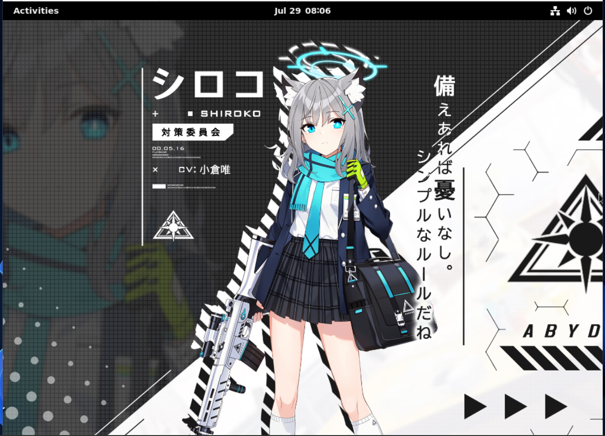

<div align="center">
  
  
  [](https://github.com/minhmc2007/Blue-Archive-Linux)
  [](#)
  [](#)
  [](#contributors)
  
  **A minimal, Blue Archive-themed Linux distribution built by Senseis, for Senseis**
  
  *Now featuring `bluepm` - our custom package manager for a seamless BA experience*
</div>

---

## 🚀 What Makes BAL Special?

<table>
<tr>
<td width="50%">

### 🎯 **Arch Philosophy, Debian Power**
- **Minimal CLI base** - Start with nothing, build everything
- **Zero bloat** - Install only what you need
- **Full control** - Your system, your rules
- **Stable foundation** - Debian's reliability meets customization freedom

</td>
<td width="50%">

### 💎 **Blue Archive Experience**
- **Stunning Shiroko wallpapers** (XFCE tested, GNOME/KDE ready)
- **bluepm package manager** - Our own package manager for BA packages
- **Clean BA branding** throughout the system
- **More BA goodies coming soon** - SDDM themes, sounds, icons

</td>
</tr>
</table>

---

## 🎮 For the Senseis

> *"This isn't just another Linux distro with anime wallpapers. This is a complete Blue Archive computing experience."*

**Perfect for:**
- 🎌 **Blue Archive fans** who want their desktop to match their passion
- 🛠️ **Power users** who love minimal, customizable systems  
- 🧑‍💻 **Developers** who want a clean, distraction-free environment
- 🎨 **Enthusiasts** who appreciate attention to detail

---

## 🔧 bluepm Package Manager

Meet `bluepm` - our custom package manager designed specifically for Blue Archive Linux!

```bash
# Install BA-specific packages
bluepm install bal-xfce bal-kde-plasma

# Search for themes
bluepm search bal-gnome

# Multiple package installation
bluepm install pkg1 pkg2 pkg3

# Keep your system updated
bluepm update-cache
```

**Features:**
- 🚀 **Lightning fast** - GitHub-based repository
- 🔒 **Secure** - Package verification and rollback support
- 🎯 **BA-focused** - Curated packages for the perfect experience
- 🛡️ **Dependency smart** - Automatic dependency resolution

---

## 🎨 Visual Experience

<details>
<summary>🖼️ <strong>Click to see screenshots</strong></summary>

<div align="center">

**KDE Plasma**


**XFCE**


**GNOME**


</div>

**What's included:**
- 🌸 **Shiroko wallpaper**
- 🎭 **Custom SDDM login themes** - *Coming soon*
- 🎨 **Coordinated color schemes** - *In development*
- 🔊 **BA system sounds** - *Planned*
- 📱 **Custom icons** - *Planned*

</details>

---

## 🚀 Quick Start

### 🔥 **Method 1: ISO Installation** (Recommended)
```bash
# Download the latest ISO
Link: https://github.com/minhmc2007/Blue-Archive-Linux/releases/latest

# Flash to USB (Linux)
sudo dd if=Blue_Archive_Linux*.iso of=/dev/sdX bs=4M status=progress

# Flash on Windows 
Use Rufus

# Boot and follow the installer or try the live environment
```

### 🛠️ **Method 2: Manual Build** (Advanced)
```bash
# Clone the repository
git clone https://github.com/minhmc2007/Blue-Archive-Linux.git
cd Blue-Archive-Linux && cd blue_archive_linux

# Run the build script
sudo bash build.sh

# Flash the generated ISO
```

### 🎯 **Post-Install Setup**
```bash
# Install your preferred desktop
bluepm install bal-kde-plasma  # or xfce4, gnome

# Set up bluepm
bluepm update-cache
```

---

## 🎯 System Requirements

<div align="center">

| Component | Minimum | Recommended |
|-----------|---------|-------------|
| 🧠 **CPU** | 64-bit x86_64 | Multi-core |
| 🧮 **RAM** | 512MB | 4GB+ |
| 💾 **Storage** | 10GB | 20GB+ |
| 📀 **Boot** | USB 2.0 | USB 3.0+ |

</div>

---

## 🧪 Join the Beta

<div align="center">

### 🫡 **Calling All Senseis!**

**We need your help to make BAL perfect!**

<a href="https://github.com/minhmc2007/Blue-Archive-Linux/issues/new?template=beta-testing.md">
  
</a>

**What you get:**
- 🎮 Early access to new features
- 💬 Direct input on development
- 🏆 Beta tester credits
- 🎁 Exclusive BA wallpapers (maybe)

**What we need:**
- 🐞 Bug reports and feedback
- 💡 Feature suggestions  
- 📸 Screenshots and use cases
- 🤝 Community building

</div>

---

## 🤝 Contributing

<div align="center">

| Area | How to Help | Skills Needed |
|------|-------------|---------------|
| 🛠️ **Development** | Core system, bluepm features | Python, Bash, Linux |
| 🎨 **Design** | Themes, wallpapers, icons | Photoshop, GIMP, UI/UX |
| 📖 **Documentation** | Guides, tutorials, wiki | Writing, Markdown |
| 🧪 **Testing** | Beta testing, bug reports | Linux experience |
| 🌐 **Community** | GitHub discussions | Communication |

</div>

### 💻 **Development Setup**
```bash
# Fork the repository
git clone https://github.com/YourUsername/Blue-Archive-Linux.git
cd Blue-Archive-Linux

# Set up development environment
sudo apt update && sudo apt install live-build

# Make your changes and submit a PR!
```

---

## 👥 Our Amazing Team

<div align="center">

### 🧠 **Core Developers**
<table>
<tr>
<td align="center">
<a href="https://github.com/minhmc2007">

<br /><sub><b>@minhmc2007</b></sub>
</a>
<br />Creator & Lead Dev
</td>
<td align="center">
<a href="https://github.com/dungdinhmanh">

<br /><sub><b>@dungdinhmanh</b></sub>
</a>
<br />Co-Developer (no longer maintaining)
</td>
</tr>
</table>

### 🧪 **Beta Heroes**
<table>
<tr>
<td align="center">
<a href="https://github.com/WatashiFuzzy">

<br /><sub><b>@WatashiFuzzy</b></sub>
</a>
<br />Beta Testing Lead (no longer testing)
</td>
<td align="center">
<a href="https://github.com/minhmc2007/Blue-Archive-Linux/issues/new?template=beta-testing.md">

<br /><sub><b>You?</b></sub>
</a>
<br />Join Our Team!
</td>
</tr>
</table>

*Note: I currently maintain this project alone; other contributors are no longer actively working on the project.*

</div>

---

## 💬 Community & Support

<div align="center">

**Get Help & Stay Connected**

[](https://github.com/minhmc2007/Blue-Archive-Linux/issues)
[](https://t.me/blue_archive_linux)
[](mailto:quangminh21072010@gmail.com)

**Join our official Telegram group:** [https://t.me/blue_archive_linux](https://t.me/blue_archive_linux)

</div>

---

## 📄 License & Credits

<div align="center">

**Blue Archive Linux** is licensed under the GPL 3 License.

**Special Thanks:**
- 🎮 **Nexon** - For creating Blue Archive
- 🐧 **Debian Project** - For the solid foundation  
- 🎨 **Blue Archive Community** - For inspiration and support
- 💻 **Open Source Community** - For the tools that make this possible
- Read CREDIT.md for more information

---

<div align="center">
  
  
  **Made with 💙 by Senseis, for Senseis**
  
  *"A minimal system with maximum Blue Archive vibes"*
  
  ⭐ **Star us on GitHub** if you're excited about BAL!
</div>

</div>
